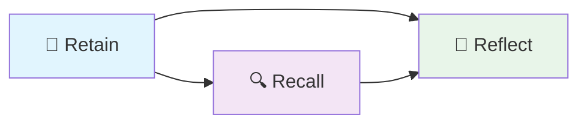

## Part 1: The Big Picture

### What Problem Are We Solving?

Imagine you're building an AI assistant for a company. After chatting with hundreds of users over months, the assistant has accumulated thousands of conversations. When a user asks "What did we decide about the database migration?", the assistant needs to:

1. **Find** the right memories among thousands
2. **Understand** which ones are relevant to _this_ question
3. **Synthesize** an answer that accounts for how decisions evolved over time

Most AI systems solve this by dumping recent conversations into context — like reading the last 20 pages of a diary. But that doesn't work when the answer is buried in a conversation from three months ago.

Hindsight solves this differently. Instead of just remembering conversations, it **learns** from them — extracting facts, building connections, and synthesizing knowledge over time. Think of the difference between a student who only re-reads their notes versus one who creates flashcards, draws concept maps, and writes summaries.

### The Three Operations

Everything Hindsight does falls into three operations:

| Operation   | What It Does                                            | Real-World Analogy                                               |
| ----------- | ------------------------------------------------------- | ---------------------------------------------------------------- |
| **Retain**  | Store new information, extract facts, build connections | Taking notes in class, then organizing them into your binder     |
| **Recall**  | Find relevant memories for a question                   | Searching your notes, index cards, and textbook at the same time |
| **Reflect** | Reason about memories to answer complex questions       | Writing an essay using your research materials                   |

Let's dive deep into each one.

---
